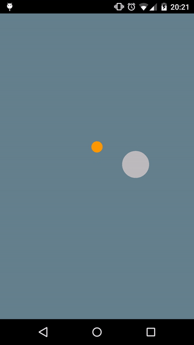

Animated Circle Loading View
=========
[ ](https://bintray.com/jlmd/maven/AnimatedCircleLoadingView/_latestVersion)
[](https://android-arsenal.com/details/1/2112)

A determiante/indetermiante loading view animation.
Based on [android-watch-loading-animation](http://www.materialup.com/posts/android-watch-loading-animation) by [Nils Banner](http://www.materialup.com/NilsMedia).

How it looks
----




Usage
----
Add AnimatedCircleLoadingView to your layout and definde mainColor and secondaryColor as custom attributes:

```java
<com.github.jlmd.animatedcircleloadingview.AnimatedCircleLoadingView
    xmlns:app="http://schemas.android.com/apk/res-auto"
    android:id="@+id/circle_loading_view"
    android:layout_width="250dp"
    android:layout_height="250dp"
    android:background="@color/background"
    android:layout_centerInParent="true"
    app:mainColor="@color/main_color"
    app:secondaryColor="@color/secondary_color"
    />
```

##### Determinate
Start determinate:

```java
animatedCircleLoadingView.startDeterminate();
```

Modify percent:
```java
animatedCircleLoadingView.setPercent(10);
```

If percent is 100, the animation ends with success animation.
On error you must call stopFailure() method, then the application ends with failure animation.

##### Indeterminate
Start indeterminate:

```java
animatedCircleLoadingView.startIndeterminate();
```

Stop with success:

```java
animatedCircleLoadingView.stopOk();
```

Stop with failure:

```java
animatedCircleLoadingView.stopFailure();
```

Gradle dependency
----
Add repository to your build.gradle

```groovy
repositories {
  maven {
    url "http://dl.bintray.com/jlmd/maven"
  }
}
```
Add dependency to your build.gradle
```groovy
compile 'com.github.jlmd:AnimatedCircleLoadingView:1.1.1@aar'
```

Developed by
---
José Luis Martín - <joseluis.martind@gmail.com>

* [LinkedIn](https://www.linkedin.com/in/jlmartind)
* [Twitter](https://twitter.com/jlmartind)

License
----
```
Copyright 2015 José Luis Martín

Licensed under the Apache License, Version 2.0 (the "License");
you may not use this file except in compliance with the License.
You may obtain a copy of the License at

   http://www.apache.org/licenses/LICENSE-2.0

Unless required by applicable law or agreed to in writing, software
distributed under the License is distributed on an "AS IS" BASIS,
WITHOUT WARRANTIES OR CONDITIONS OF ANY KIND, either express or implied.
See the License for the specific language governing permissions and
limitations under the License.
```